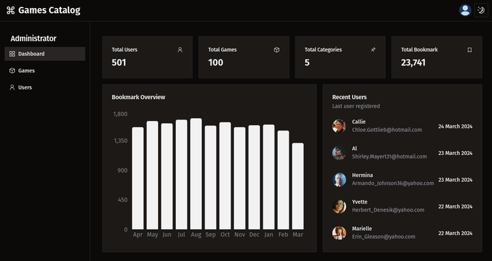
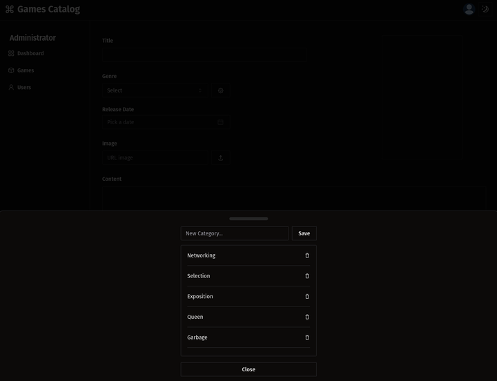
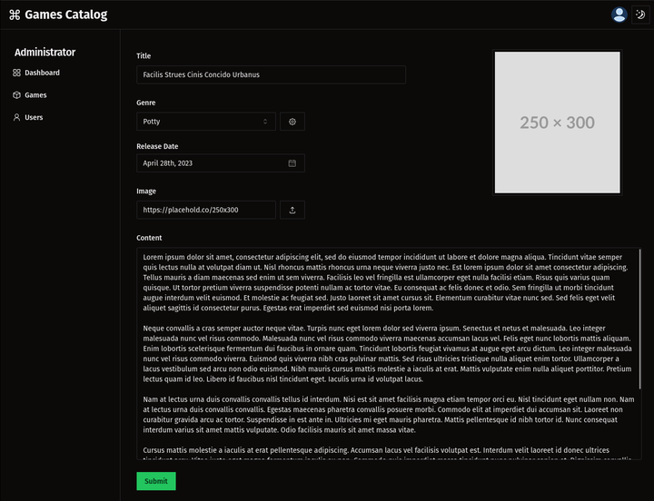
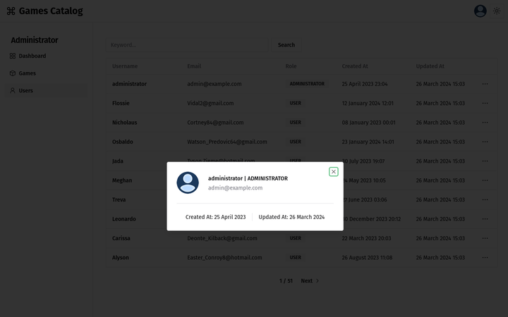
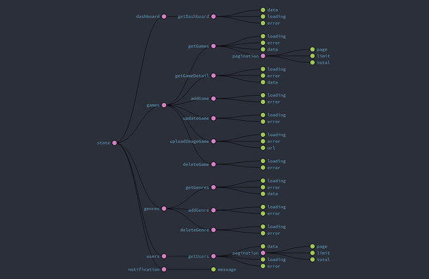

## Games Catalog

#### built with

| Tools  |  |
| :--- | :--- |
| React  | https://react.dev  |
| Redux | https://redux.js.org  |
| Shadcn UI | https://ui.shadcn.com |
| etc |  |

#### API

https://github.com/qrizan/nestjs-swagger-prisma

#### api configuration .env
```
copy .env.example .env
```
example
```
VITE_API_URL=http://localhost:3000
```

`VITE_API_URL` dipakai hanya untuk `pnpm dev` — nilainya di-*bake* saat build oleh Vite.

#### container image

```
ghcr.io/qrizan/react-shadcn-redux:<versi>
```

Tag versi dibuat dari git tag `v*.*.*`, tanpa tag `latest`. Image adalah SPA statis di belakang nginx (non-root, port 8080). API URL **tidak** di-*bake* ke image — dibaca dari environment container saat start dan ditulis ke `config.js`, sehingga image yang sama bisa dipakai untuk API URL berapa pun:

```bash
docker run -d --name web -p 8080:8080 \
  -e API_URL='https://api.example.com' \
  ghcr.io/qrizan/react-shadcn-redux:0.0.1-rc.2
```

#### store folder structure 

```
...
├── src
│   ├── api
│   ├── dtos
│   ├── services
│   ├── store
│   │   ├── actions
│   │   ├── reducers
│   │   ├── sagas
│   │   ├── selectors
│   │   ├── store.ts
│   │   └── types
│   ├── views
...
```
#### running
```
cd react-shadcn-redux
pnpm install
pnpm dev
```
#### screenshots









#### state preview ( redux dev tools )


  